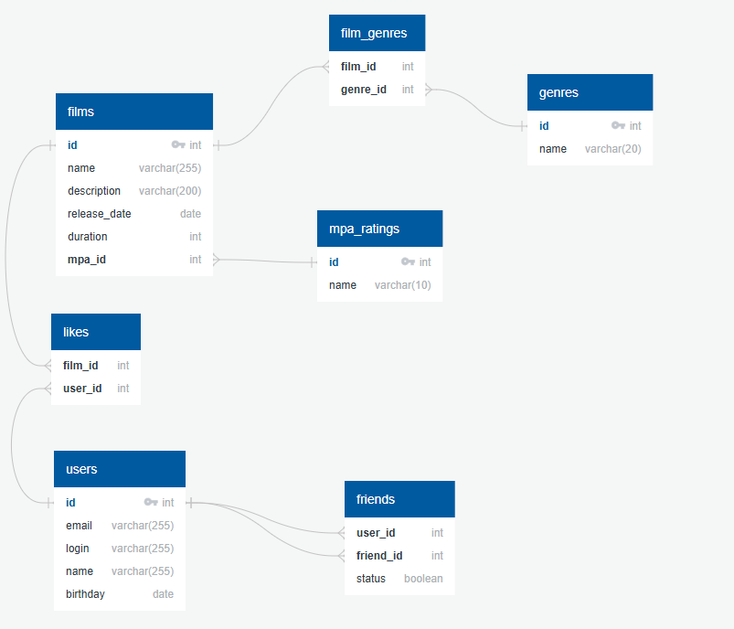

# java-filmorate
Template repository for Filmorate project.
---
## Схема базы данных

---
- **films** — информация о фильмах.
- **genres** — жанры.
- **film_genres** — жанры фильма.
- **mpa_ratings** — возрастные рейтинги.
- **users** — данные пользователей.
- **friends** — дружба пользователей.
- **likes** — лайки фильмов.
---
## Пример запроса
### Топ-10 лучших фильмов
```sql

SELECT film_id,

  COUNT(user_id) AS likes

FROM likes

GROUP BY film_id

ORDER BY likes DESC

LIMIT 10;